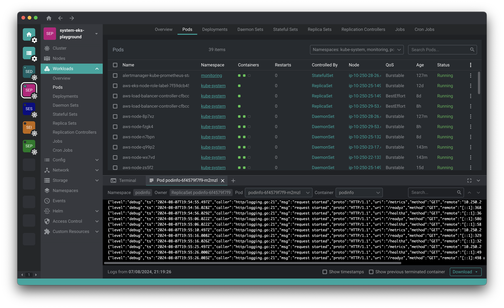

# Freelens

## The Repository

This repository is a fork of [Open Lens](https://github.com/lensapp/lens/tree/master), core of [Lens Desktop](https://k8slens.dev), with the aim of carrying forward its open source version.

Freelens is a standalone application for MacOS, Windows and Linux operating systems.
Below is a screenshot and video from the original Open Lens repository.



### Prequisites

* Nodejs v18

### Build app

```sh
npm install
npm run build
npm run build:app
```

At this point, for example on Windows, simply go to the
"freelens\open-lens\dist\win-unpacked" directory and run Freelens.exe.

## Development

The primary aim is currently to maintain the current open source code with its functionality and fix bugs.

### Run app

To run app in developer's mode:

```sh
npm run start-dev
```

## Contributing

Anyone is welcome to collaborate to advance the Freelens project.

## License

This source code is available to everyone under the [MIT license](./LICENSE).
