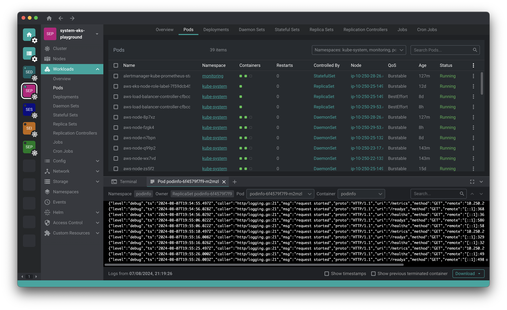

# Freelens

<!-- markdownlint-disable MD013 -->

[](https://freelens.app)
[](https://github.com/freelensapp/freelens)
[](https://github.com/freelensapp/freelens?tab=MIT-1-ov-file#readme)
[](https://github.com/freelensapp/freelens/releases/latest)
[](https://formulae.brew.sh/cask/freelens#default)
[](https://winstall.app/apps/Freelensapp.Freelens)
[](https://flathub.org/apps/app.freelens.Freelens)
[](https://aur.archlinux.org/packages/freelens-bin)
[](https://www.npmjs.com/package/@freelensapp/core)
[](https://github.com/freelensapp/freelens/actions/workflows/unit-tests.yaml)
[](https://github.com/freelensapp/freelens/actions/workflows/integration-tests.yaml)
[](https://github.com/freelensapp/freelens/actions/workflows/trunk-check.yaml)

<!-- markdownlint-enable MD013 -->

[Freelens](https://freelens.app) is a free and open-source user interface
designed for managing Kubernetes clusters. It provides a standalone
application compatible with macOS, Windows, and Linux operating systems,
making it accessible to a wide range of users. The application aims to
simplify the complexities of Kubernetes management by offering an intuitive
and user-friendly interface.



## Downloads

See the [releases](https://github.com/freelensapp/freelens/releases) page and
download the right package for your system.

### macOS

macOS 11 or later is required.

Download either the PKG (installer) or DMG (image) package from the
[releases](https://github.com/freelensapp/freelens/releases) page. Both arm64
(M1 chip or newer) and amd64 (Intel) variants are available.

All binary packages are built on macOS 14 and should be compatible with newer
systems.

#### Homebrew

Run the following command:

```sh
brew install --cask freelens
```

### Linux

Linux with GNU C Library 2.34 or later is required. It is provided ie. by
Debian 12, Fedora 35, Mint 21, openSUSE Leap 15.4, Ubuntu 22.04 and by
rolling release distributions like Arch, Manjaro or Tumbleweed.

Download DEB or RPM (package) or AppImage (executable) from the
[releases](https://github.com/freelensapp/freelens/releases) page. Both arm64
(aarch64) and amd64 (x86_64) variants are available.

All binary packages are built on Ubuntu 22.04 and should be compatible with
new systems.

#### AppImage

The Linux AppImage file requires libz.so and libfuse.so.2. You can add them
by running:

```sh
sudo apt install libfuse2 zlib1g-dev
```

Run the application with additional arguments:

<!-- markdownlint-disable MD013 -->
```sh
./Freelens*.AppImage --no-sandbox --ozone-platform-hint=auto --enable-features=WebRTCPipeWireCapturer --enable-features=WaylandWindowDecorations --disable-gpu-compositing
```
<!-- markdownlint-enable MD013 -->

#### Flatpak

The package is available on the
[Flathub](https://flathub.org/apps/app.freelens.Freelens) App Store for
Linux.

Run the following commands:

```sh
flatpak install flathub app.freelens.Freelens
flatpak run app.freelens.Freelens
```

The application is sandboxed. It includes bundled `kubectl` and `helm`
commands and uses the `~/.kube/config` file by default.

Flatpak adds wrappers for the `aws`, `doctl`, `gke-gcloud-auth-plugin`, and
`kubelogin` tools, running them as commands from the host system.

The terminal uses `/bin/sh` by default, but it can be switched to, for
example, `/bin/bash` for a sandboxed environment or `/app/bin/host-spawn` for
a host environment.

#### APT repository

Run the following commands:

<!-- markdownlint-disable MD013 -->

```sh
curl -L https://raw.githubusercontent.com/freelensapp/freelens/refs/heads/main/freelens/build/apt/freelens.asc | sudo tee /etc/apt/keyrings/freelens.asc
curl -L https://raw.githubusercontent.com/freelensapp/freelens/refs/heads/main/freelens/build/apt/freelens.sources | sudo tee /etc/apt/sources.list.d/freelens.sources
sudo apt update
sudo apt install freelens
```

#### Arch User Repository

The package is available on the [Arch User Repository
(AUR)](https://wiki.archlinux.org/title/Arch_User_Repository).

Check the [freelens-bin](https://aur.archlinux.org/packages/freelens-bin)
package page.

### Windows

Windows 10 or later is required.

Download the EXE or MSI installers from the
[releases](https://github.com/freelensapp/freelens/releases) page.

Only the x64 (amd64) version of the Windows binaries is provided.

#### WinGet

The package is available in
[WinGet](https://winstall.app/apps/Freelensapp.Freelens) Community
[repository](https://github.com/microsoft/winget-pkgs).

Run the following command:

```powershell
winget install Freelensapp.Freelens
```

The `--silent` option is supported to suppress all UI.

## Development

Read [DEVELOPMENT.md](DEVELOPMENT.md) to see how to build the application
from source.

## Extensions

Anyone can develop extensions for Freelens and many extensions previously used with Open Lens have already been converted.  
Visit the [extensions page](https://github.com/freelensapp/freelens/wiki/Extensions) to see them and write in the [appropriate discussion](https://github.com/freelensapp/freelens/discussions/117) if you also want to propose yours.

## Community

Get updates about Freelens & keep in touch with our community  

- Follow us on [LinkedIn](https://www.linkedin.com/company/freelensapp/)
- Join our [Discussions](https://github.com/freelensapp/freelens/discussions)
- Chat on [Discord](https://discord.gg/NjKZERK95Y)
- Read our [Wiki](https://github.com/freelensapp/freelens/wiki)
- Open an [Issue](https://github.com/freelensapp/freelens/issues)

## Contributing

Anyone is welcome to collaborate to advance the Freelens project. Read
[CONTRIBUTING.md](CONTRIBUTING.md) to see how you can help.


## Expenses and Donations

Anyone can support the Freelens project by making donations to cover maintenance costs and invest in its development.  
For more information, see our dedicated page in our Wiki: [Expenses and Donations](https://github.com/freelensapp/freelens/wiki/Expenses-and-Donations)

## License

This repository is a fork of [Open
Lens](https://github.com/lensapp/lens/tree/master), the core of [Lens
Desktop](https://k8slens.dev), with the aim of carrying forward its
open-source version.

Copyright (c) 2024-2025 Freelens Authors.

Copyright (c) 2022 OpenLens Authors.

[MIT License](https://opensource.org/licenses/MIT)
